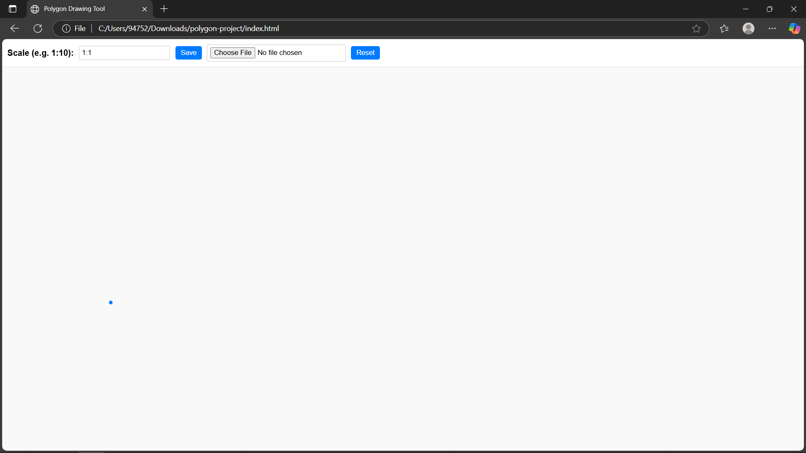
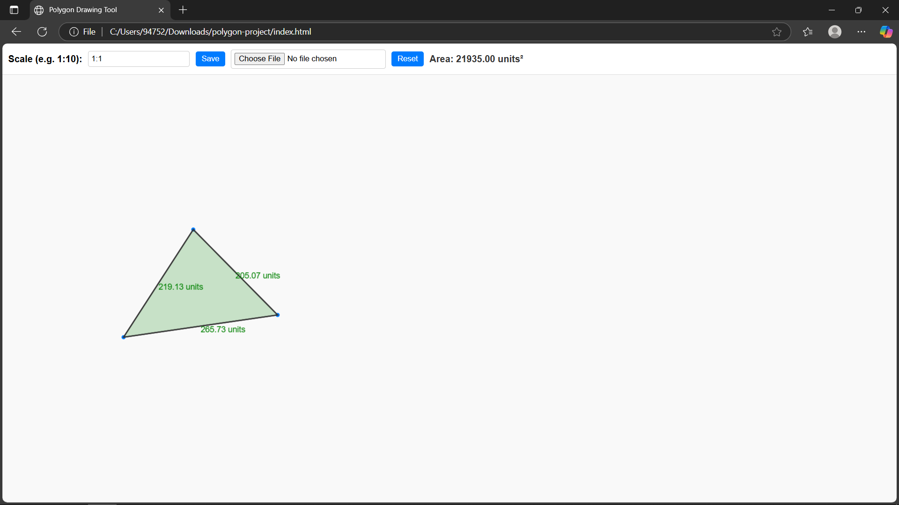
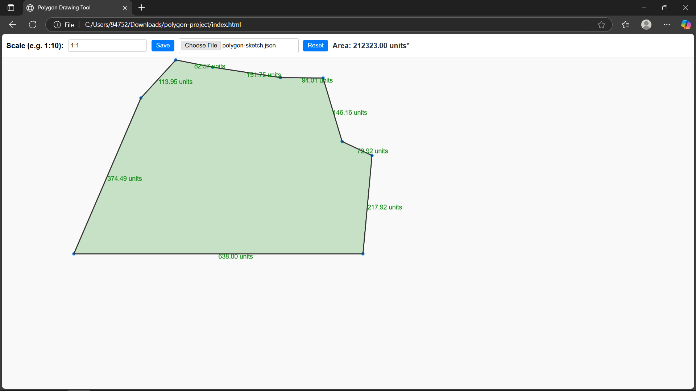

# 🖌️ Polygon Drawing Tool

A simple, intuitive polygon drawing tool built using **Konva.js**. Allows users to interactively draw polygons, measure side lengths, calculate areas, and handle scaled dimensions.



---

## 🌟 Features

- **Interactive Polygon Drawing:** 
  - Draw polygons by clicking to add points.
  - Automatic polygon closure on clicking near the first point.

- **Real-time Dimensioning & Area Calculation:**
  - Displays side lengths dynamically on the canvas.
  - Calculates and displays polygon area.

- **Customizable Scale:**
  - Adjust scale easily (e.g., `1:10`).
  - Dimensions and area adjust automatically.

- **Save and Load:**
  - Save your sketches as downloadable JSON files.
  - Reload sketches easily from saved files.

- **Intuitive UI:**
  - Modern, clean user interface.
  - Responsive toolbar with clear controls.

---

## 📸 Screenshots

| Polygon Drawing                   | Area & Dimensions                  |
|-----------------------------------|------------------------------------|
|    |   |


## 🛠️ Technologies Used

- HTML5 & CSS3
- JavaScript
- [Konva.js](https://konvajs.org/) (Canvas interaction)

---

## 🚀 Getting Started

### **Installation**

Clone or download this repository:

```bash
git clone <your-github-repo-link>
```

### **Running the Tool**

Simply open `index.html` in your web browser:

```bash
polygon-project/
├── index.html
├── style.css
└── script.js
```

### **How to Use**

- Click on the canvas to add polygon points.
- Click close to the first point to finish the polygon.
- Adjust scale using the input at the top toolbar.
- Save/load your sketch using provided toolbar buttons.

---

## 📁 Project Structure
```
polygon-project/
├── index.html      # Main HTML file
├── style.css       # UI styling
├── script.js       # Core logic and functionality
└── README.md       # Project Documentation
```

---

## 🎓 Assignment Requirements Covered
- ✔️ Draw polygon by connecting lines
- ✔️ Display dimensions and polygon area
- ✔️ Enter custom scale to update measurements
- ✔️ Save and load sketches seamlessly

---

## 📧 Author

- **Nuraj Shaminda**
  - [GitHub Profile](https://github.com/Nuraj250)
  - [LinkedIn Profile](https://www.linkedin.com/in/nuraj-shaminda-3b3512194/)